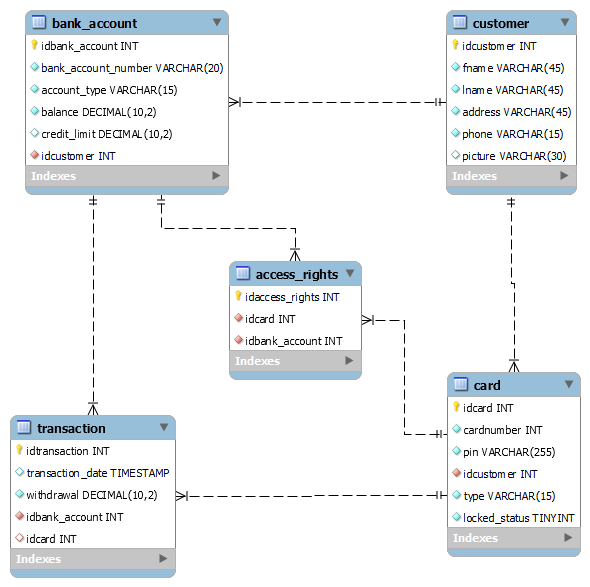

# ATM - Riihimaatti 
#### *Group 17 (TVT24KMO)*

---

## Table of contents

*sisällysluettelo tähän*
- *Project introduction*
- *Project goals*
- *Usage instructions*
- *Documentation*
- *Project outcome*
- *Contributors*

---

## Usage instructions

*Jotain fiksua tähän*

---

## Documentation

### Backend

```sh
cd backend
npm install
npm run dev
```
#### API??

#### Server/Linux??

#### Database

For this project we created SQL database with MySQLWorkbench

**ER-diagram:**



**Design for our database:**
- Customer
    - Columns: firstname, lastname, address, phonenumber
    - Customer can have many accounts
    - Customer can have multiple cards
- Card
    - Columns: cardnumber, pin-number, card type, locked status and foreign key for customer
    - Card can have multiple access right to different accounts (debit, credit, debit/credit)
    - Card must have one owner
    - Card can have multiple transactions
- Bank account
    - Columns: account number, account type, balance, credit limit and foreign key for customer
    - Bank account must have only one owner
    - Bank account can have multiple transactions
    - Bank account can grant multiple access rights to cards
- Transaction
    - Columns: transaction date, withdrawal amount, foreign keys for bank account and card
    - One transaction must have one card
    - One transaction must have one bank account
- Access rights
    - Columns: foreign keys for card and bank account
    - One access right must have one card and one bank account

### Frontend

#### User interface (QT)

---

## Project outcome

---

## Contributors

