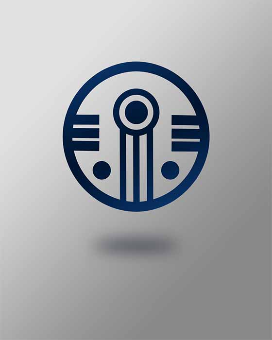

# ATM - Riihimaatti 
#### *Group 17 (TVT24KMO)*

---

## Table of contents

- *Project introduction*
- *Project goals*
- *Usage instructions*
- *Documentation*
- *Project outcome*
- *Contributors*

---

## Project introduction

The aim of this project was to develop an ATM application, using the knowledge the student-developers learned on previous courses while studying software development at Oulu University of Applied Scienses.

[Riihimaatti_ProjectPoster](PosterRiihimaatti.jpg)


---

## Project goals

 :star: The purpose of this project was to create an ATM application which combines SQL database, REST API, Linux server and Qt Creator.

 :star: The aim was to become confident users of technologies, which were used in the project.

 :star: We aimed to use the knowledge, which we learnt in previous courses at the Oulu University of Applied Sciences, and apply our knowledge. Moreover, we wanted to expand our knowledge in given fields and technologies. 

---

## Usage instructions

### Development

#### Database

This application requires MySQL server. Some suggestions for development use: [UniServer zero](https://www.uniformserver.com/), [Docker image](https://hub.docker.com/_/mysql/). Use LTS version 8.4.X unless you have particular reason why you shouldn't.

Repository provides two files to kickstart your database, use them to initialize your database with data.

- `RiihimaattiStructureDump.sql`
- `RiihimaattiDataDump.sql`

#### Backend

For backend development you should have Node.js with version 20.x installed ([nodejs.org](https://nodejs.org/)) and MySQL server available. 

Copy file `backend/.template.env` as `backend/.env` and fill in your data. `PORT` defaults to 3001 if not given and `SQL_SERVER_PASSWORD` to `''` (no password).

Then in root of project folder:

```sh
cd backend
npm install
npm run dev
```

Folder `backend/apitests` has lot's of ready to go api calls ready. Usage requires _REST Client_ extension by Huachao Mao in VS Code. [Read more and install.](https://marketplace.visualstudio.com/items?itemName=humao.rest-client)

#### Client application

Client application is implemented with Qt. To install student/community licensed applications, visit [Qt download portal](https://www.qt.io/download-dev).

---

### Deployment

Server application runs on Node.js (currently 20.x) and should be platform-agnostic. Set environment parameters on your environment. Refer to platform/OS provider for best practices. Install dependencies with `npm install`. Server starts with `npm start`. Make sure your server provider runs this (and preferrably `npm install`) command on system start.

Client software curretly requires manual transfer to target device. Automatic updates are on roadmap and are available soon™️.

#### Database

Make sure your database-instace contains database named in your `SQL_SERVER_DATABASE`. On first run, initialize database structure with `RiihimaattiStructureDump.sql`.

## Documentation

### Deployment

Project uses Github actions to deploy latest update of backend server to Azure. Application runs as Web App with MySQL flexible server in same Resource group. Backend service is available at [riihimaatti.azurewebsites.net](https://riihimaatti.azurewebsites.net).

For now at least, client software must be manually taken to target device. Target device must have supported and updated Windows installation (Linux should technically work, but not tested). Github Action currently compiles client application on pull request for any compile time errors but doesn't provide standalone application.

---
### Database

For this project we created SQL database with MySQLWorkbench

**ER-diagram:**


**Design for our database:**
- Customer
    - Columns: firstname, lastname, address, phonenumber, profile picture
    - Customer can have multiple accounts and/or cards
- Card
    - Columns: cardnumber, pin-number, card type, locked status and foreign key for customer
    - Card can have multiple access right to different accounts (debit, credit, debit/credit)
    - Card must have one owner
    - Card can have multiple transactions
- Bank account
    - Columns: account number, account type, balance, credit limit and foreign key for customer
    - Bank account must have only one owner
    - Bank account can have multiple transactions
    - Bank account can grant multiple access rights to cards
- Transaction
    - Columns: transaction date, withdrawal amount, foreign keys for bank account and card
    - One transaction can have one card
    - One transaction must have one bank account
- Access rights
    - Columns: foreign keys for card and bank account
    - One access right must have one card and one bank account
---
### Frontend

**Logo:** 



Also available on .png for easy use.

---
### User interface (QT)


First, the app opens a login interface. The ATM app asks customer's card number and pin code. After successful authentification, it opens the main interface of the ATM app. There are four buttons in the ATM app's main interface. 
- The "Show balance" button shows the balance of the logged in customer's bank account. 
- The "Make a withdrawal" button opens a new interface where customer can choose the desired amount for withdrawal.
- The "Browse transactions" button lists 10 transactions to a new interface where customer can browse previous transactions.
- The "logout" button is visible in every interface after successfull login. Logout deletes and resets all objects needed to run ATM.

---

### Project outcome

The application meets all the design requirements and functions efficiently, as intended. All components work together as planned. The software demonstrates stability with no critical errors or crashes during testing.

We divided the work equally among the group, and everyone participated in all aspects of the project. The development process was completed successfully with minimal challenges.​

Further development of the project would have focused on strengthening security features, such as data protection.​

---

### Contributors

This project was constructed by four students: Atte Perämäki, Paula Kaartinen, Janina Niemelä and Satu Palviainen. 